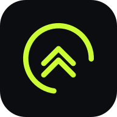

# Stride 🏃

A run tracker built around a rolling training block. It started life as a
four-week "road to 5K" plan; now the 5K is done, the plan keeps extending and
the app aims at whatever race is next. Tick off each day, track runs by GPS,
watch your charts grow, and get nudged when it's time to head out. It installs
to your phone like a normal app and works offline.



## Features

- **Rolling training plan** with run / easy / rest days, extendable by the AI coach.
- **Race goals**: pick a target from 5K to marathon, set a race date, and get a
  predicted finish time and a distance-readiness read-out.
- **Race predictions**: Riegel-equivalent times at 1K, 5K, 10K, half and full,
  derived from your best logged effort.
- **Live GPS tracking** with route map, splits, cadence, elevation, calories,
  run/walk intervals, auto-pause and audio cues.
- **Route maker**: loops, out-and-backs and hand-drawn routes on the real road
  network, from OpenStreetMap data.
- **Notifications while you run**: a live notice with distance, time and pace,
  plus kilometre splits, run/walk switches and a finish summary — all switchable.
- **Stats & charts**: km per week logged vs plan, pace trend, cumulative
  distance, a day-by-day calendar, personal records and achievements.
- **History**: every session with distance, time, pace, route thumbnail, splits
  and a replay.
- **AI coach** (optional, your own free Groq key) for analysis and new plan blocks.
- **Six accent themes**, and an installable PWA: add to your home screen, works
  offline, your data stays on your phone.

---

## Put it on your phone (Nothing Phone / any Android)

You need to host the built app somewhere with an `https://` link, then install
that link on your phone. Pick whichever host is easiest for you — the project is
pre-configured for all of them.

### Option A — Cloudflare (already wired up)

This repo includes Cloudflare's own integration: `@cloudflare/vite-plugin` plus
a `wrangler.jsonc`, so `npm run build` produces a deployable bundle and
`npm run deploy` (`vite build && wrangler deploy`) ships it. The easiest path is
to connect the repo in the Cloudflare dashboard (Workers & Pages → connect to
Git) — it then redeploys automatically on every push. You'll get a
`…​.workers.dev` link.

### Option B — Netlify (also works from your phone, free, even for private repos)

1. Go to **netlify.com** and sign up (you can log in with GitHub).
2. **Add new site → Import an existing project → GitHub**, authorize, and pick
   this repo.
3. The build settings auto-fill from `netlify.toml` (command `npm run build`,
   publish `dist`). Click **Deploy**.
4. After ~1 minute you get a link like `https://<random-name>.netlify.app`.

> **Vercel** works the same way — import the repo and deploy; `vercel.json`
> handles the settings.

### Option B — GitHub Pages

1. Repo → **Settings → Pages → Source → "GitHub Actions"**.
2. Merge this branch into **`main`** (every push to `main` auto-deploys).
3. Your link appears in the Pages settings:
   `https://<username>.github.io/raod-to-5k-and-more/`
   (Note: GitHub Pages on a **private** repo needs a paid plan — use Option A if
   yours is private.)

### Then, on your phone

1. Open your link in **Chrome**.
2. Tap **⋮ menu → Install app** (or "Add to Home Screen"). An icon appears.
3. Open it from the icon, go to the **Stats** tab, turn on **Daily Reminder**,
   pick a time, and **Allow** notifications when asked.

> Heads up on reminders: a website can't fire an exact alarm when it's fully
> closed the way a built-in alarm app can. Installing it (step 6) gives the most
> reliable reminders — your phone will catch up and notify you the next time the
> app wakes in the background. If you ever miss one, opening the app shows
> today's session straight away.

---

## Build the real Android app (.apk)

This repo is also wrapped with **Capacitor**, so the same code installs as a
native Android app. The big advantage over the web version: **reminders are
scheduled by Android itself and fire even when the app is fully closed**, plus
native GPS. You build the APK once on a computer, then install it on the phone.

**You need:** a computer with **[Android Studio](https://developer.android.com/studio)**
installed (it brings the Android SDK + Java), and this repo cloned.

```bash
npm install                 # Node 20+
npm run build               # build the web app into dist/
npx cap sync android        # copy it into the native project
npm run android:open        # opens the project in Android Studio
```

In Android Studio: let it finish syncing Gradle, plug in your phone (or use an
emulator), and press **Run ▶**. It installs straight to the phone.

Prefer the command line? With the Android SDK set up:

```bash
npm run android:apk         # builds android/app/build/outputs/apk/debug/app-debug.apk
```

Copy that `app-debug.apk` to your phone and open it (you'll need to allow
"install unknown apps" for your file manager). The app icon is **Stride**.

> Notes: this is a *sideloaded* debug build — perfect for your own phone.
> Publishing to the Google Play Store additionally needs a one-time \$25 Google
> developer account and a signed release build. The app icon/splash are
> generated by `npm run android:assets` from the lime logo.

## Run it on a computer (for development)

```bash
npm install      # Node 20+
npm run icons    # generate the app icons (first time only)
npm run dev      # start the dev server, open the printed URL
npm run build    # production build into dist/
npm run preview  # preview the production build
```

See `CLAUDE.md` for the code architecture.
